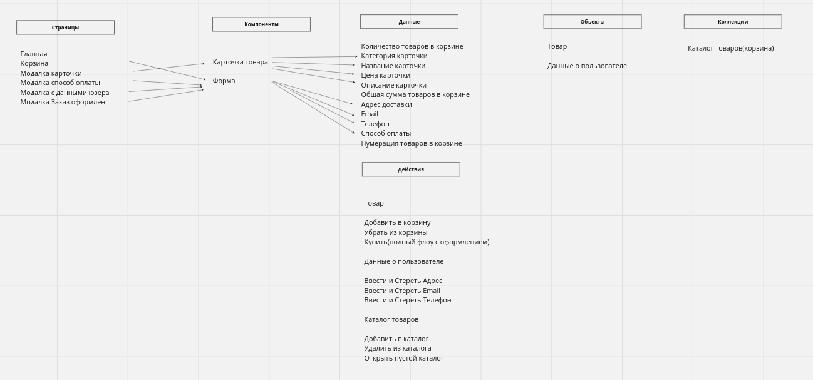
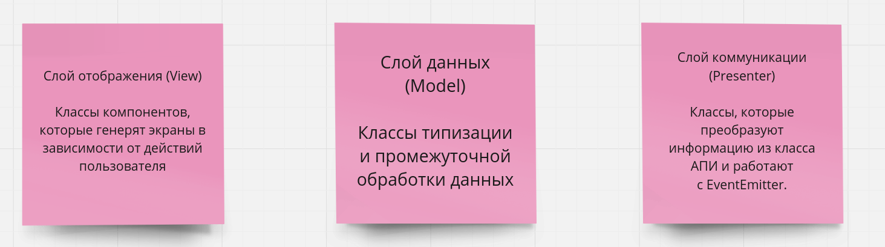

# Проектная работа "Веб-ларек"

Стек: HTML, SCSS, TS, Webpack

Структура проекта:
- src/ — исходные файлы проекта
- src/components/ — папка с JS компонентами
- src/components/base/ — папка с базовым кодом

Важные файлы:
- src/pages/index.html — HTML-файл главной страницы
- src/types/index.ts — файл с типами
- src/index.ts — точка входа приложения
- src/styles/styles.scss — корневой файл стилей
- src/utils/constants.ts — файл с константами
- src/utils/utils.ts — файл с утилитами

## Установка и запуск
Для установки и запуска проекта необходимо выполнить команды

```
npm install
npm run start
```

или

```
yarn
yarn start
```
## Сборка

```
npm run build
```

или

```
yarn build
```

## Описание и UML

#### Архитектура приложения поделена на 3 слоя:

Слой данных Model - хранит данные состояния приложения и бизнес-логику. Слой взаимодействует с классами AppData и Product. Класс Product типизирован и находится в types/index.ts IProductItem.

Слой отображения View - занимается рендером карточек, модалок, форм и прочих визуальных элементов. Слой взаимодействует с классами Card, Modal, Form, SuccessfulOrder, Basket. 

Слой коммуникации Presenter - является связующим для слоя данных и отображения. Слой предоставляет и обрабатывает данные, получаемые от сервера. Работает с классами API и EventEmitter.

#### Описание классов


#### Типы данных в types/index.ts

```typescript

// Интерфейс для отдельной карточки

export interface IProductItem {
  id: string;
  description: string;
  image: string;
  title: string;
  category: string;
  price: number | null
}

// Интерфейс для корзины или главной страницы

export interface IProductList {
  total: number;
  items: IProductItem[]
}

// Интерфейс для заполнения форм пользователем

export interface IUserOrder {
  address: string;
  email: string;
  phone: string;
  payment: 'online' | 'cash',
  total: number;
  items: IProductItem[]
}

// Интерфейс для успешного заказа

export interface ISuccessfulOrder {
  id: string;
  total: number
}

```

#### Состояния приложения


#### Дополнительные схемы






